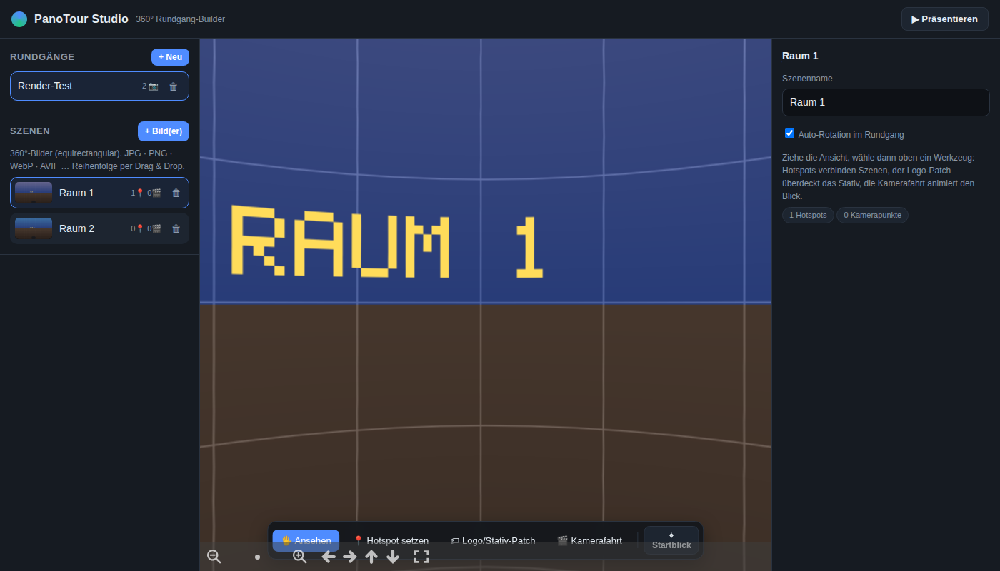

# 🌐 PanoTour Studio

Ein Dashboard, um aus 360°-Bildern einen interaktiven **Panorama-Rundgang** zu
bauen — mit Hotspots zwischen Räumen, einem **Logo-Patch**, der Stativ oder
Fotograf am Boden überdeckt, und einer **dynamischen Kamerafahrt** über frei
gesetzte Punkte.

Läuft komplett lokal (eigener kleiner Server + SQLite-Datenbank). Die
Viewer-Bibliotheken sind mitgeliefert — **kein Internet nötig**.



---

## Schnellstart

Voraussetzung: **Node.js ≥ 18** (getestet mit Node 22).

```bash
cd panotour-studio
npm install          # installiert express, multer, better-sqlite3
npm start            # startet den Server
```

Dann im Browser öffnen: **http://localhost:3000**

> Beim ersten `npm install` wird für `better-sqlite3` eine vorkompilierte
> Binärdatei geladen. Falls kein Netz vorhanden ist, siehe „Offline" unten.

Sofort ausprobieren: unter `samples/` liegen zwei Test-Panoramen
(`raum1.png`, `raum2.png`) und ein `logo.png`. Rundgang anlegen → beide Bilder
hochladen → loslegen.

---

## Funktionen

| Bereich | Was es kann |
|---|---|
| **Rundgänge & Szenen** | Beliebig viele Rundgänge, pro Szene ein 360°-Bild. Reihenfolge per Drag & Drop. |
| **Upload** | Gängige Formate: JPG, PNG, WebP, AVIF, GIF, BMP, TIFF, SVG (bis 60 MB). *Hinweis: HEIC/HEIF & manche TIFF zeigt der Browser nicht direkt an — vorher zu JPG/WebP konvertieren.* |
| **📍 Hotspots** | Ins Bild klicken → Punkt setzen → mit einer anderen Szene verknüpfen. Im Rundgang klickt man sich so von Raum zu Raum. |
| **🏷 Logo / Stativ-Patch** | Logo hochladen (transparentes PNG ideal). Es liegt flach am Boden und überdeckt Stativ/Fotograf. Größe per Regler, Position per Klick (nach unten schauen). |
| **🎬 Kamerafahrt** | Blick ausrichten → „Punkt setzen". Beliebig viele Punkte, je mit eigener Dauer. „Abspielen" fährt die Kamera weich (ease-in-out) durch alle Punkte. |
| **▶ Präsentieren** | Vollbild-Ansicht ohne Bedien-Panels, optional mit Auto-Rotation. |
| **Startblick** | Aktuelle Blickrichtung + Zoom als Startansicht der Szene speichern. |

Alles wird automatisch in der Datenbank gespeichert (kleiner Hinweis „Gespeichert ✓" oben rechts).

---

## Aufbau

```
panotour-studio/
├── server.js            Express-Server + REST-API
├── db.js                SQLite-Schema (better-sqlite3)
├── generate-sample.js   erzeugt die Test-Panoramen in samples/
├── data/
│   ├── panotour.db      Datenbank (wird automatisch angelegt)
│   └── uploads/         hochgeladene Bilder & Logos
├── public/
│   ├── index.html
│   ├── css/styles.css
│   ├── js/app.js        Dashboard-Logik
│   ├── js/viewer.js     360°-Viewer (Hotspots, Logo-Patch, Kamerafahrt)
│   └── vendor/          Photo Sphere Viewer + three.js (lokal, kein CDN)
└── samples/             Beispiel-Panoramen + Logo
```

**Technik:** [Photo Sphere Viewer 5](https://photo-sphere-viewer.js.org/)
(auf three.js) im Frontend, Node/Express + SQLite im Backend. Die
Kamerafahrt ist eine eigene, per Keyframes gesteuerte Animation.

## Datenmodell

`tours → scenes → { hotspots, keyframes }`. Das Logo hängt am Rundgang, die
Patch-Einstellungen (Größe, Position, an/aus) pro Szene.

---

## API (Auszug)

| Methode | Pfad | Zweck |
|---|---|---|
| `GET` | `/api/tours` | alle Rundgänge |
| `GET` | `/api/tours/:id` | Rundgang mit Szenen, Hotspots, Keyframes |
| `POST` | `/api/tours` | Rundgang anlegen |
| `POST` | `/api/tours/:id/logo` | Logo hochladen |
| `POST` | `/api/tours/:id/scenes` | Szene (Bild) hochladen |
| `PUT` | `/api/scenes/:id` | Szene aktualisieren (Name, Startblick, Logo-Patch) |
| `POST` | `/api/scenes/:id/hotspots` | Hotspot setzen |
| `PUT` | `/api/scenes/:id/keyframes` | Kamerafahrt speichern |

---

## Konfiguration & Offline

- **Port ändern:** `PORT=8080 npm start`
- **Offline:** Der Viewer braucht kein Internet (Bibliotheken liegen in
  `public/vendor/`). Nur `better-sqlite3` lädt beim `npm install` eine
  Binärdatei. Auf einem Rechner mit Netz einmal `npm install` ausführen und den
  Ordner inkl. `node_modules/` mitnehmen — dann läuft alles offline.
- **Sample-Bilder neu erzeugen:** `node generate-sample.js`

---

## Nächste sinnvolle Schritte (Ausbau)

- Export des Rundgangs als eigenständige, teilbare HTML-Datei
- Automatische HEIC/TIFF-Konvertierung serverseitig (z. B. via `sharp`)
- Kamerafahrt über mehrere Szenen hinweg (aktuell pro Szene)
- Mehrbenutzer/Login, wenn die Rundgänge geteilt werden sollen

Viel Spaß beim Bauen! 🎬
